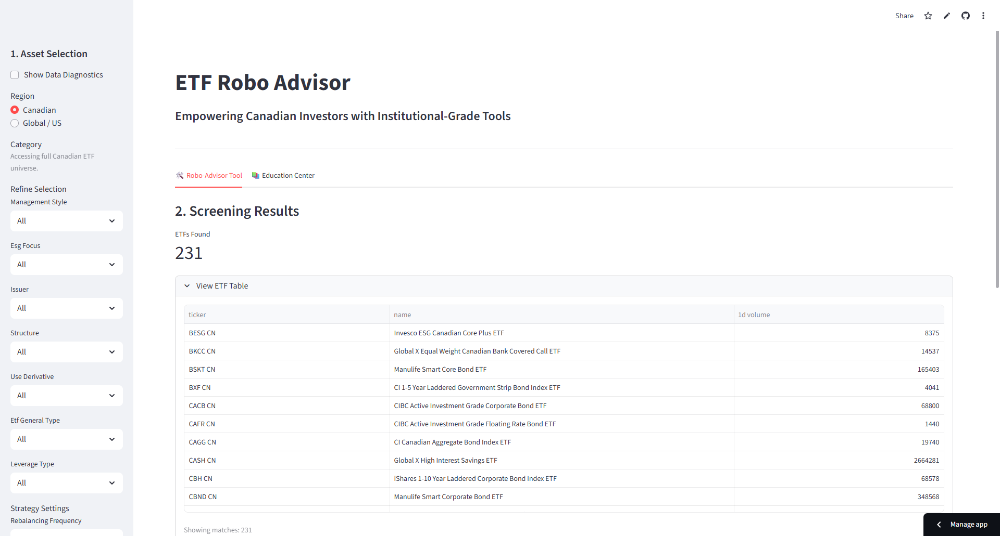
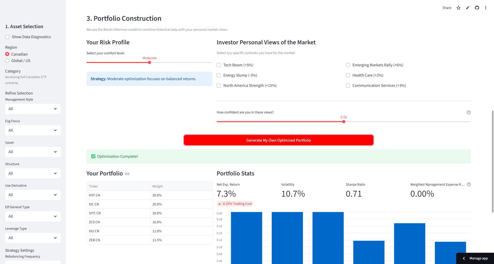

# Deconstructed DIY Robo-Advisor (Deco-Robo)

🌐 **Live Website**  
👉 https://roboadvisor-kezhangdanluominhuong.streamlit.app/

Deco-Robo is an **interactive ETF robo-advisor web application** designed to help users construct diversified portfolios based on modern portfolio theory and investor views. The platform combines **ETF screening, portfolio optimization, and Black-Litterman modeling** into a transparent, user-driven experience.

---

## Product Preview

### ETF Screening & Portfolio Setup

### Portfolio Output & Risk Visualization

---

## Project Overview

Deco-Robo is built as a **DIY robo-advisor toolkit**, allowing users to:
- Explore the Canadian ETF universe
- Filter ETFs by asset class, region, and liquidity
- Generate optimized portfolios
- Incorporate personal market views into portfolio construction

The goal is to make **institutional-grade portfolio logic** accessible and explainable to individual investors.

---

## Core Features

### 1. ETF Universe Construction
- ETF data sourced from **Bloomberg**
- Coverage across:
  - Equity (sector & thematic ETFs)
  - Fixed income (government, corporate, EM)
  - Geographic exposure (Canada & US)
- Data cleaning and validation:
  - Missing value thresholds
  - Liquidity filters (volume, bid-ask spread)
  - Price history completeness checks

---

### 2. Portfolio Optimization
- Mean-Variance Optimization (Modern Portfolio Theory)
- Objective: **maximize Sharpe ratio**
- Real-time covariance matrix estimation
- User-controlled portfolio weights and constraints

---

### 3. Black-Litterman Model
- Combines market equilibrium returns with **user-defined views**
- Allows investors to express opinions such as:
  - “Bullish on Technology”
  - “Reduce exposure to Emerging Markets”
- Produces adjusted expected returns and portfolio weights

---

### 4. Interactive Web Application
- Built with **Streamlit**
- Dynamic sidebar filters and controls
- Instant portfolio recomputation
- Visual presentation of:
  - Asset weights
  - Risk-return characteristics
  - Allocation breakdowns

---

## Technology Stack

- **Python** – core logic and modeling
- **Streamlit** – web application framework
- **Pandas / NumPy** – data manipulation
- **SciPy** – numerical optimization
- **Bloomberg** – ETF data source (offline preprocessing)

---

## How to Use

1. Visit the live website  
   👉 https://roboadvisor-kezhangdanluominhuong.streamlit.app/
2. Select asset filters and ETF universe
3. Adjust portfolio preferences and views
4. Generate and review the optimized portfolio
5. Iterate and explore alternative scenarios

No installation is required for end users.

---

## Design Philosophy

- **Transparency first**: users see how inputs affect outputs
- **Explainable allocation logic**, not black-box recommendations
- **Modular architecture** that can be extended with:
  - Live price APIs
  - Tax optimization
  - Factor or ESG constraints
  - Sentiment-based views

---

## Disclaimer

This project is for **research, educational, and demonstration purposes only**.

- Portfolio outputs depend on historical data and modeling assumptions
- Optimization results are sensitive to inputs and constraints
- This application does **not** constitute investment advice or recommendations

---

